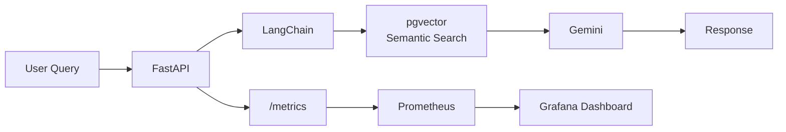

# RAG on Kubernetes

[](https://github.com/akshatkarnwal/rag-k8s/actions/workflows/ci.yml)

Production RAG pipeline deployed on Kubernetes — FastAPI + pgvector + Gemini + Prometheus + Grafana.

## Architecture



## Stack

|     Component    |           Technology                                                     |
|------------------|--------------------------------------------------------------------------|
| API              | FastAPI + Uvicorn                                                        |
| RAG Framework    | LangChain                                                                |
| Vector DB        | pgvector (PostgreSQL)                                                    |
| LLM              | Gemini 2.5 Flash                                                         |
| Embeddings       | Gemini Embedding 2 (3072-dim)                                            |
| Auth             | JWT (python-jose/bcrypt)                                                 |
| Task Queue       | Celery + Redis (scaffolding — see [Task Queue](#task-queue-in-progress)) |
| Orchestration    | Kubernetes (minikube)                                                    |
| Autoscaling      | HPA (CPU + memory based)                                                 |
| Observability    | Prometheus + Grafana                                                     |
| Containerisation | Docker                                                                   |
| Testing & CI     | pytest, pytest-mock, GitHub Actions                                      |
| Load Testing     | Locust                                                                   |

## Features

- Document ingestion pipeline with chunking and embedding
- Semantic search over pgvector with cosine similarity
- Production FastAPI with liveness and readiness probes
- JWT-authenticated `/query` endpoint — `/health` and `/metrics` remain open for probes/scraping
- Celery + Redis task queue wired up and verified end-to-end (worker/broker/result-backend loop); no application logic routed through it yet — see [Task Queue](#task-queue-in-progress)
- Prometheus metrics: query rate, P95 latency, docs indexed, chunks retrieved
- Grafana dashboards for real-time observability
- HPA autoscaling between 1-3 replicas
- Kubernetes Secrets for API key management
- Automated test suite (pytest) with mocked dependencies, run on every push and pull request via GitHub Actions
- Load tested with Locust — see [Load Testing](#load-testing) for real findings

## Quick Start

### Local development

```bash
# clone and setup
git clone https://github.com/akshatkarnwal/rag-k8s
cd rag-k8s
cp .env.example .env  # add your GEMINI_API_KEY and auth settings — see Authentication section below

# start pgvector
docker run -d --name pgvector \
  -e POSTGRES_PASSWORD=postgres \
  -e POSTGRES_DB=vectordb \
  -p 5432:5432 pgvector/pgvector:pg16

# install and run
uv sync
uv run uvicorn app.main:app --reload --port 8000
```

### Deploy to Kubernetes

This project builds multiple images via `docker-compose` (the API service and a Celery worker) — build through compose, not a bare `docker build`, so the correct image name/tag is produced:

```bash
# start minikube
minikube start

# build the API image directly inside minikube's Docker daemon
# (avoids stale-image caching issues with `minikube image load`)
eval $(minikube docker-env)
docker compose build rag-api

# deploy
kubectl apply -f k8s/configmap.yaml
kubectl apply -f k8s/secret.yaml      # add GEMINI_API_KEY, DB_PASSWORD,
                                       # JWT_SECRET_KEY, DEMO_USERNAME,
                                       # DEMO_PASSWORD_HASH first
kubectl apply -f k8s/pgvector-deployment.yaml
kubectl apply -f k8s/pgvector-service.yaml
kubectl apply -f k8s/deployment.yaml
kubectl apply -f k8s/service.yaml
kubectl apply -f k8s/hpa.yaml

# get service URL
minikube service rag-k8s-service --url
```

**Note:** `deployment.yaml`'s container image must reference `rag-k8s-rag-api:latest` (the image `docker compose build rag-api` produces), not a generic `rag-k8s:latest` — a mismatch here will deploy stale code with no error until requests start failing.

## Authentication

The `/query` endpoint requires a JWT bearer token. `/health` and `/metrics`
are intentionally left open, since health probes and Prometheus scraping
shouldn't require a login.

```bash
# 1. get a token
curl -X POST http://localhost:8000/token \
  -d "username=<your-username>&password=<your-password>"

# 2. use it to call the protected endpoint
curl -X POST http://localhost:8000/query \
  -H "Content-Type: application/json" \
  -H "Authorization: Bearer <paste-token-here>" \
  -d '{"question": "How do I restart the DNIF worker?"}'
```

This project uses a single demo user (configured via environment
variables) rather than a full user table — a reasonable, honest scope
for a personal project. Swapping `verify_demo_user()` in `app/auth.py`
for a real lookup against a `users` table in the existing Postgres
instance would be the natural next step for a multi-user system; the
JWT issuance/verification mechanics stay the same either way.

Required environment variables (see `.env.example`):

|      Variable         |                  Purpose                                      |
|-----------------------|---------------------------------------------------------------|
| `JWT_SECRET_KEY`      | Signing key for tokens — generate with `openssl rand -hex 32` |
| `JWT_EXPIRE_MINUTES`  | Token lifetime (default: 60)                                  |
| `DEMO_USERNAME`       | The single demo user's username                               |
| `DEMO_PASSWORD_HASH`  | Bcrypt hash of the demo password — never store plaintext      |

Generate a `DEMO_PASSWORD_HASH` with:
```bash
python3 -c "import bcrypt; print(bcrypt.hashpw(b'your-password', bcrypt.gensalt()).decode())"
```

## API

```bash
# health check (no auth required)
curl http://localhost:8000/health

# query (auth required — see Authentication section)
curl -X POST http://localhost:8000/query \
  -H "Content-Type: application/json" \
  -H "Authorization: Bearer <token>" \
  -d '{"question": "How do I restart the DNIF worker?"}'

# prometheus metrics (no auth required)
curl http://localhost:8000/metrics
```

## Testing

The test suite mocks `ingest_documents` and `build_rag_chain` before FastAPI's
lifespan runs, so tests never touch a real Postgres instance or the real
Gemini API — fast, free, and deterministic. Auth-related tests patch
`app/auth.py`'s module-level constants directly (rather than just the
environment), since those values are read once at import time.

```bash
# install test dependencies
uv add --dev pytest pytest-mock httpx

# run the suite
uv run pytest -v
```

Coverage includes:
- Root and health endpoint checks
- Prometheus metrics endpoint (format and increment-on-request)
- Auth: successful login, wrong username/password, missing/invalid token
- `/query` happy path (with a valid token), with exact response-shape assertions
- Validation: missing `question` field (422) vs. empty/whitespace string (400)
- Error handling: retriever failure correctly surfaces as a 500

## CI/CD

Every push and pull request to `master` runs the full test suite via GitHub
Actions (`.github/workflows/ci.yml`), using `uv sync --locked` to install
the exact dependency versions from `uv.lock` — so CI always matches what's
tested locally, not just whatever resolves at the time. The workflow
supplies dummy auth credentials as environment variables (never real
secrets) so the test suite's auth coverage runs the same way in CI as
it does locally.

## Key Design Decisions

**Why pgvector over Pinecone?**
pgvector runs inside PostgreSQL — no additional infrastructure. For thousands to millions of documents, it's the right tradeoff between simplicity and scale.

**Why chunk_size=500, overlap=100?**
Small chunks lose context; large chunks reduce retrieval precision. 500 characters with 100-character overlap preserves semantic units while keeping retrieval focused.

**Why HPA on CPU+memory?**
LLM inference is CPU-bound for embedding generation. Memory-based scaling catches pgvector connection pool exhaustion before it causes errors.

**Why Kubernetes Secrets for API keys?**
Secrets are injected as environment variables at runtime — rotating a key means updating the Secret and rolling the Deployment, with no code change required.

**Why JWT with bcrypt instead of a simpler API key?**
JWTs carry an expiry and can be verified statelessly without a database lookup on every request. bcrypt's intentional CPU cost protects against offline brute-forcing of the stored password hash — though as load testing below shows, that same CPU cost becomes a real constraint under the deployment's CPU limits.

**Why Celery + Redis for the task queue?**
Celery is the standard, well-supported choice for Python background task processing, with built-in retry semantics and broker flexibility. Redis was chosen as the broker since it's already running in this stack for other purposes, avoiding new infrastructure.

**Why mock the RAG chain in tests instead of hitting the real Gemini API?**
Gemini's free tier is tightly rate-limited. Mocking `build_rag_chain` and
`ingest_documents` at the FastAPI lifespan boundary keeps the test suite
fast and free to run on every single commit, while still exercising the
real request/response contract of the API itself.

**Why a single demo user instead of a full auth system?**
Scope-appropriate for a personal project — the goal was to demonstrate
real JWT issuance/verification mechanics on a production-shaped API, not
to build a user-management system. The mechanics (signing, expiry,
bearer-token verification) are identical to what a multi-user system
would use.

## Observability

Prometheus scrapes `/metrics` every 15 seconds via ServiceMonitor.

|           Metric            |    Type   |        Description            |
|-----------------------------|-----------|-------------------------------|
| `rag_query_total`           | Counter   | Total queries by status       |
| `rag_query_latency_seconds` | Histogram | Query latency (P50/P95/P99)   |
| `rag_chunks_retrieved`      | Histogram | Chunks retrieved per query    |
| `rag_docs_indexed_total`    | Gauge     | Documents indexed in pgvector |

## Load Testing

Load tested with [Locust](https://locust.io/) against the minikube-deployed service, with Prometheus/Grafana and HPA watched live during each run.

### Setup

```bash
uv add --dev locust
export DEMO_USERNAME=<demo-username>
export DEMO_PASSWORD=<demo-password>
uv run locust -f locustfile.py --host http://localhost:8000
```

`locustfile.py` simulates two user types: an authenticated `RagQueryUser` (logs in once via `/token`, then repeatedly calls `/query`) and a lightweight unauthenticated `HealthCheckUser` hitting `/health`, weighted 9:1 so the majority of load exercises the real RAG pipeline. A hard cap on total `/query` calls protects Gemini's free-tier daily quota during test runs.

### Results

**Baseline — 2 concurrent users, 30s:**

| Endpoint | Requests | Failures | Median latency  |
|----------|----------|----------|-----------------|
| `/query` | 4        | 0%       | 3.8s            |
| `/token` | 2        | 0%       | 1.7s            |

At light load, the full pipeline (JWT auth → retrieval → Gemini generation) works cleanly end-to-end, with `/query` latency dominated by the Gemini API round-trip.

**Under load — 10 concurrent users:**

Scaling to 10 concurrent users surfaced two real bottlenecks, not simulated ones:

1. **Gemini free-tier daily quota (20 requests/day)** was exhausted almost immediately. The Gemini client's built-in retry logic (`tenacity`, exponential backoff on `429 RESOURCE_EXHAUSTED`) meant each failed `/query` call silently retried ~6 times before giving up — driving individual request latency up to 51-56 seconds before returning a 500, rather than failing fast. This is a real production consideration: a naive retry policy against a rate-limited upstream can turn a fast failure into a very slow one.

2. **bcrypt-based JWT login showed CPU contention under the pod's resource limits.** The deployment caps the `rag-k8s` container at `500m` CPU (half a core). bcrypt's password verification is intentionally CPU-expensive by design, and under 9 concurrent login attempts competing for that half-core, `/token` latency climbed from a clean ~1.7s baseline to 6.5-11s — a 4-6x slowdown with zero failures, purely from CPU contention.

| Endpoint | Requests | Failures | Latency (min–max)                     |
|----------|----------|----------|---------------------------------------|
| `/query` | 9        | 100%     | 51.6s – 55.8s (failed after retries)  |
| `/token` | 9        | 0%       | 6.5s – 11.0s                          |
| `/health`| 19       | 0%       | 4ms – 353ms                           |

### Takeaways

- The RAG pipeline itself (retrieval + generation) is correct and performant at low concurrency — the bottleneck at scale is the upstream Gemini free-tier quota, not the application code or Kubernetes deployment.
- CPU resource limits (`500m`) are tight enough to visibly bottleneck bcrypt-based auth under concurrent login load; a production deployment would want either a higher CPU limit or a faster hashing configuration (lower bcrypt work factor, or moving to a session-token model that avoids re-hashing on every login).
- `/health` stayed fast and stable throughout every run, including during the `/query` failures — confirming the failures were isolated to the Gemini-dependent path, not a broader application or infrastructure issue.

## Task Queue (in progress)

Celery + Redis are wired up (`app/tasks.py`, `app/worker.py`) and verified working end-to-end — a task submitted via `.delay()` is picked up by the worker and its result retrieved via `.get()`. Currently this proves the worker/broker/result-backend loop only; no application logic runs through it yet. The planned next step is moving document ingestion onto this queue so re-indexing large runbook sets doesn't block the API.

## What I Learned

- End-to-end RAG pipeline architecture
- pgvector HNSW index for approximate nearest neighbour search
- Kubernetes Deployments, Services, ConfigMaps, Secrets, HPA
- Prometheus ServiceMonitor for automatic target discovery
- Production FastAPI patterns: lifespan, health probes, metrics endpoint
- Testing FastAPI apps with lifespan-managed state: mocking dependencies
  before `TestClient` triggers startup, rather than patching after the fact
- Wiring GitHub Actions CI end-to-end, including debugging real issues
  along the way (pytest import path via `pythonpath` in `pyproject.toml`,
  matching the Python version to the local environment, and matching the
  workflow's branch trigger to the repo's actual default branch)
- Implementing JWT auth with FastAPI's `OAuth2PasswordBearer` /
  `Depends()` pattern, and the importance of when environment variables
  get read: module-level reads at import time need to be patched at the
  attribute level in tests, not just via the environment, since the
  module only reads `os.environ` once
- Debugging a CI-only test failure caused by `.env` existing locally but
  not on the CI runner (correctly, since it's gitignored) — fixed by
  supplying dummy test credentials directly in the workflow's `env:` block
- Diagnosing Kubernetes deployment drift: a container image name mismatch
  between the deployment manifest and the actual built image caused it to
  silently run stale code for weeks with no error, only surfacing when a
  genuinely new code path (`/token`) returned 404 in production despite
  existing in source
- Load testing as a diagnostic tool, not just a benchmarking one — a
  10-user Locust run surfaced two real, previously-invisible bottlenecks
  (LLM provider rate limits and CPU-constrained bcrypt hashing) that only
  appear under concurrent load